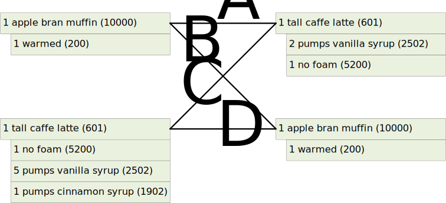
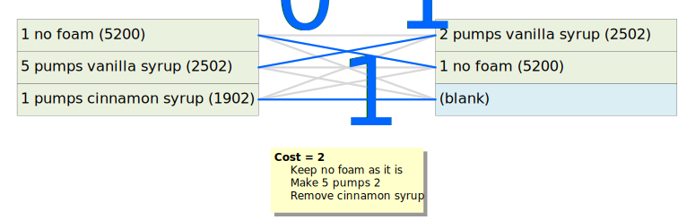
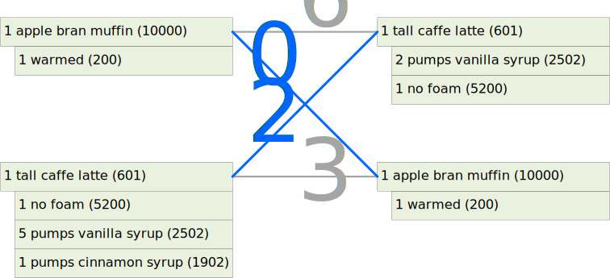

# Calculating Repair Cost

The `Repair Cost Metric` measures the number of actions required to transform an incorrect cart into one that has all of the expected items. While it may be desirable to present products in order they were rung up, the repair cost only considers the sequence of operations necessary to ensure the items in the customer's bag will be correct. It makes no attempt to rearrange the items in the cart.

In the following, we present a formal definition for repair cost and its implicit assumptions, and then describe the algorithm and its implementation.

We conclude with a discussion of the challenges of computing repair cost when menu data is not available.

## Repair Cost Assumptions
The repair cost algorithm relies on a number of assumptions about the operations available at a Point-of-Sale Terminal (POS):

* The quantity of a product or option can be changed by an arbitrary amount in a single operation.
  * `1 grande latte` => `5 grande latte`
* An attribute can be added, removed, or replaced in a single operation
  * `grande latte` => `tall latte`
  * `grande latte` => `iced grande latte`
  * `iced grande latte` => `grande latte`
  * `no foam` => `extra foam`
* A default quantity of a product or option with default attributes can be added in a single operation
  * Add `1 grande latte`
  * Add `1 vanilla syrup`
* Any product or option can be removed in a single operation, regardless of quantity or attributes.
  * Remove `1 grande latte`
  * Remove `5 grande latte`
  * Remove `extra foam`
  * Remove `vanilla syrup`
  * Remove `1 grande latte with extra foam`
* Adding a product or option with custom quantity or attributes or options requires multiple steps
  * First add the default quantity of the product
  * Then update the quantity
  * Then update each attribute
  * Then add each option
* Replacing a product requires a delete, followed by an insert.
  * `2 iced tall mocha` => `2 iced tall latte`

While one could contemplate enhancements to the POS user interface that might improve repair process efficiency, the set of assumptions listed above still do a good job at quantifying the number of concepts that are incorrect in a shopping cart. This is important when evaluating the quality of speech-to-cart systems.

## Repair Cost Algorithm

We can think of the shopping cart as a set of product-option trees. Each tree corresponds to a fully configured product. The root contains the product SKU and its quantity. The children specify the option SKUs and their quantities.

We would like to find the minimal sequence of edits that transforms an observed tree into the expected tree. We can think of this as a recursive [assignment problem](https://en.wikipedia.org/wiki/Assignment_problem). The goal is to find the optimal assignment between observed and expected products, where the cost for an individual assignment is the cost of converting the observed product into the expected product.

When the observed and expected products have the same generic form, the cost of assignment is the sum of

* the cost of correcting any quantity mismatch
* the cost of correcting any attribute mismatch
* the cost of the assignment between observed and expected options

When the observed and expected products have different generic forms, the cost of assignment is

* the cost of removing the observed product
* the cost of adding the expected product along with its options

Let's look at an example. Suppose the observed cart contains
~~~
1 apple bran muffin (10000)
    1 warmed (200)
1 tall latte (601)
    1 no foam (5200)
    5 vanilla syrup (2502)
    2 cinnamon syrup (1902)
~~~

Suppose the expected cart is
~~~
1 tall latte (601)
    2 vanilla syrup (2502)
    1 no foam (5200)
1 apple bran muffin (10000)
    1 warmed (200)
~~~

We can see, by inspection, that the products are the same, but in a different order, and some of the options don't match. For instance, in the observed cart, there are too many pumps of vanilla syrup, and there's another syrup - cinnamon - which does not appear in the expected cart.

In the following diagram, the observed cart is on the left and the expected cart is on the right. We want to find the minimum cost assigment, using matchings A, B, C, and D.

Our first step is to label each matching with its cost.

In the case of matching A, the products are different, so the cost is the 6 steps to
* remove the apple bran muffin
* add a default sized latte
* change the size from grande to tall
* add vanilla syrup
* make its quantity two pumps
* add the no foam option

In the case of matching B, the products are identical, so we perform a recursive assignment on their options. Since their options are identical, as well, the cost for matching B is 0.

Matching C is interesting. In this case, the products match, so we perform a recursive assignment on their options.

Of the nine possible matchings,
* 4 involve replacing one option with another
* 3 involve removing an option
* 1 involves changing the number of pumps
* 1 is a perfect match

The minimal assignment, shown above in blue, has a cost of 2.

Matching D is like A in that the products are different, so the cost is the 3 steps to
* remove the latte
* add an apple bran muffin
* add the warmed option

Here is the top-level view, with all of the matching costs marked. The optimal assignment is shown in blue, with a total cost of 2.

The repairs for the optimal assignment are
* Make 5 pumps of vanilla syrup 2
* Remove the cinnamon syrup

## Implementation
The repair algorithm involves 3 steps:
* Generate a repair cost matrix
  * Rows correspond to observed products
  * Columns correspond to expected products
  * Cell (i,j) contains the edit sequence and cost to transform observed product i into expected product j.
  * Cells are filled in using recursive repair call on option lists.
* Use [Munkres Assignment Algorithm](https://en.wikipedia.org/wiki/Hungarian_algorithm) to find the optimal assignment. This runs in O(n^3) time, where n the size of the cost matrix.
* Use the assignment to extract the edit sequence and total repair cost from the cost matrix.

The [prix-fixe](https://github.com/MikeHopcroft/PrixFixe) library provides an implementation in the following files:
* [menu_based_repairs.ts](https://github.com/MikeHopcroft/PrixFixe/blob/master/src/test_suite2/menu_based_repairs.ts)
* [bipartite_matching_diffs.ts](https://github.com/MikeHopcroft/PrixFixe/blob/master/src/test_suite2/bipartite_matching_diff.ts)

## Use of Menu Data

To compute the repair cost, we need access to menu data. The reason is that the SKUs alone don't contain enough information to determine whether two items are completely different or just differ by an attribute.

For example these carts have a repair cost of 2
~~~
OBSERVED              EXPECTED
1 SKU 606             1 SKU 601
  1 SKU 5200            1 SKU 5200
  2 SKU 2502            2 SKU 2502
~~~

while these nearly identical carts have a repair cost of 7
~~~
1 SKU 801             1 SKU 601
  1 SKU 5200            1 SKU 5200
  2 SKU 2502            2 SKU 2502
~~~

To see why, let's look at the three carts with item descriptions:
~~~
FIRST OBSERVED
1 iced venti latte (605)
  1 no foam (5200)
  2 vanilla syrup (2502)

EXPECTED
1 tall latte (601)
  1 no foam (5200)
  2 vanilla syrup (2502)

SECOND OBSERVED
1 tall mocha (801)
  1 no foam (5200)
  2 vanilla syrup (2502)
~~~

In the first pair of carts, converting the `iced venti latte` to the `tall latte` involves
* change the `venti` attribute to `tall`
* remove the `iced` attribute

In the second pair of carts, converting the `tall mocha` to the `tall latte` involves
* remove the `mocha`
* add a `latte`, which has a default size of `grande`
* change the size attribute to `tall`
* add the `foam` option, which has a default attribute of `add`.
* change its attribute to `no`
* add the `vanilla syrup` option
* change its quantity to `2`

The menu contains the information we see in the product names, but this information is in a structured for that allows one to determine whether items are related, but with different attributes, or completely unrelated.

It also contains information about default attributes and quantities. These default values closely match the defaults used in the POS operations. In general, a default-configured product can be added in one operation. Then additional operations can be used to introduce non-default attributes and quantities.

These examples illustrate why the menu is necessary and why other approaches like text-diffing cash register tapes are likely to be unsuitable.

With that said, [prix-fixe](https://github.com/MikeHopcroft/PrixFixe) does provide a simple repair cost metric that does not require access to menu data.
 
